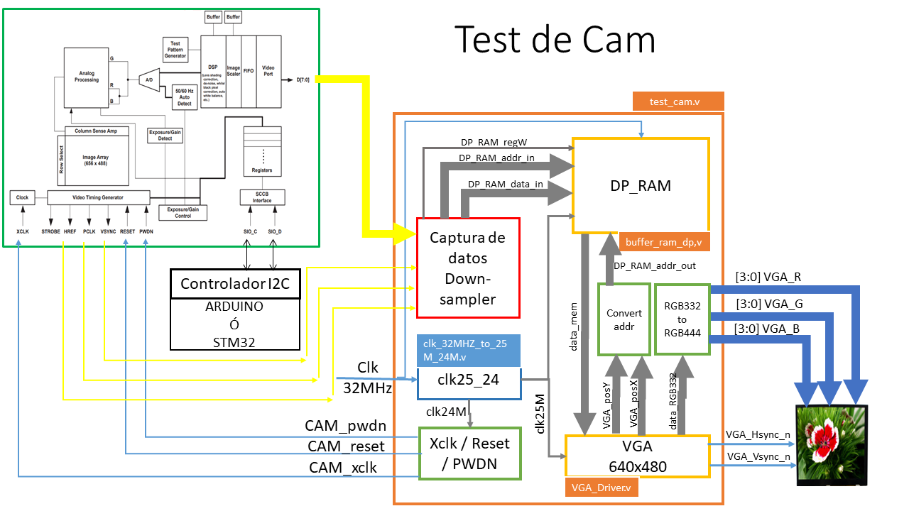
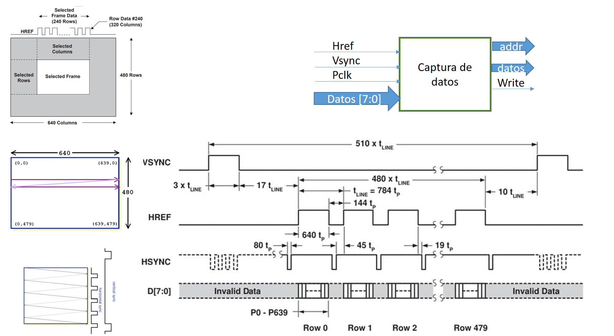
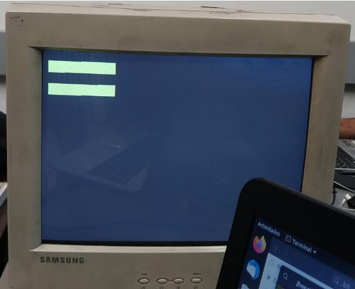
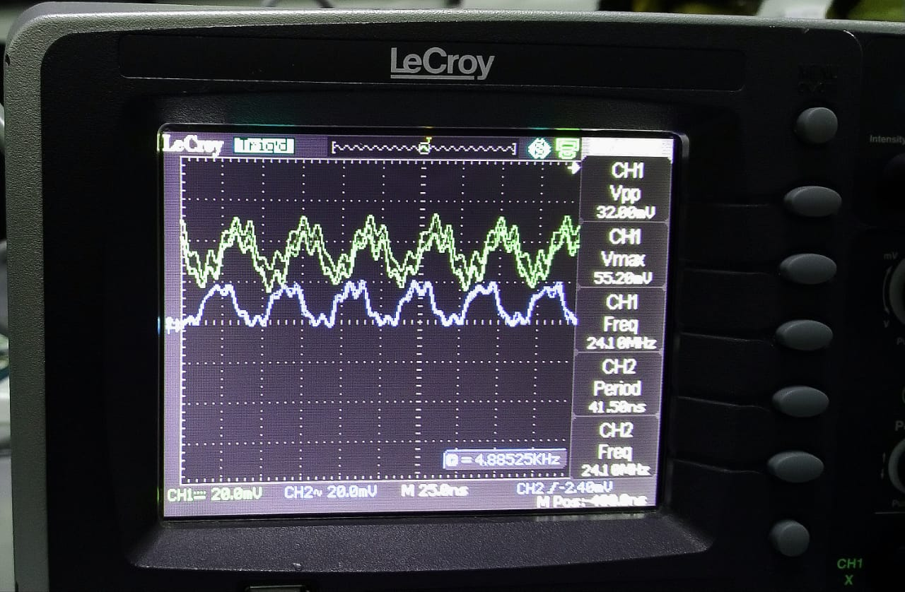
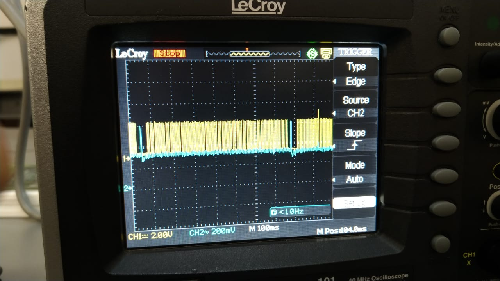

## ELECTRÓNICA DIGITAL 2 2019 -2 UNIVERSIDAD NACIONAL DE COLOMBIA 
## TRABAJO 01- diseño y prueba del HDL para la cámara OV7670

## Introducción 
El sistema de captura de datos de la cámara debe adquirir la información de los pixeles y almacenarlos en el buffer de memoria.
Se propone el siguiente esquema de trabajo, donde el estudiante puede testear el funcionamiento del driver de la cámara diseñado. Eventualmente se puede cambaiur VGA para LVDS

En este paquete de trabajo los estudiantes deben, en primera instancia, diseñar e implementar la captura datos de la cámara y, adaptar los datos para que se almacene en memoria el pixel con el formato RGB332.

Luego de tener el diseño "captura_datos_downsampler" deben instanciar el bloque HDL en el test_cam.v. y probar la funcionalidad del diseño. Para ello, debe analizar el proyecto propuesto **test_cam.xise** junto con el siguiente figura:

Como se observa en la figura anterior, el bloque en rojo y las señales en amarillo indican que el grupo de trabajo deben adicionarla dicha información al proyecto **test_cam.xise** para completar el funcionamiento.

El bloque en azul es el PLL que realiza el divisor de frecuencias requeridas 25Mhz y 24Mhz, en el ejemplo este módulo se implementa con una entrada de reloj de 32Mhz y para la FPGA spartan6. Por tal motivo, es necesario que cada grupo adapte este bloque a la tarjeta que está usando. En el desarrollo del paquete de trabajo se da las indicaciones para hacer este proceso. 

Para este paquete de trabajo, el estudiante deben estar inscrito en un grupo y copiar la información del siguiente link [WP01](https://classroom.github.com/g/sHf0ZmsW).
Debe escribir la documentación en el archivo README.md de la carpeta docs. Recuerde, esta documentación debe ser tal que, cualquier compañero de futuros semestres comprenda sus anotaciones y la relación con los módulos diseñados.

***Recuerde: Revisar las instrucciones dadas en metodología y documentación.***

## Material 

Para este paquete de trabajo se debe contar con:

* Pantalla con entrada VGA y cuya resolución sea 640x480.
* FPGA que cuenta con puerto VGA.
* Cable VGA.
* Plantilla del proyecto sugerido [WP01](https://classroom.github.com/g/sHf0ZmsW).
* Datasheet de la cámara OV7670.

## Desarrollo

Como se ha explicado en clase, este paquete de trabajo debe desarrollar el siguiente bloque funcional:

Para lo cual, la captura de datos debe ser acorde al funcionamiento de la cámara. para ello debe analizar la siguiente gráfica:

1. Diseñar el sistema digital de captura de los pixeles de la cámara. No es necesario incluir las señales de control  Xclk, pwdn y reset, estas están descritas en el top del proyecto.
2. Diseñar el downsampler y transmitir la información al buffer de memoria. Recuerde la memoria se ha diseñado para almacenar el pixel en formato RGB332, y almacenar 3 bit para el color Rojo y Verde y 2 bit para el color Azul. Si usted, por ejemplo, selecciona el formato RGB565 de la cámara debe convertir los 5 bit de rojo en 3 bit.

***RECUEDE: Es necesario documentar el módulo diseñado con los respectivos diagramas funcionales y estructurales y registrar la información en README.md ***

Una vez clone el repositorio, en su computador de la plantilla del proyecto [WP01](https://classroom.github.com/g/sHf0ZmsW), realizar lo siguiente:

3. Revisar si el bloque PLL, `clk_32MHZ_to_25M_24M.v` (diagrama azul de la figura 1), propuesto en el bloque test_cam.v, cumple con las necesidades de reloj de entrada y salida para la plataforma utilizada. Recuerde el sistema requiere además de los 32, 50 o 100 Mhz de entrada, generar dos señales de reloj de 25Mhz y 24 Mhz para la pantalla VGA y la Cámara respectivamente. En este sentido, el archivo `clk_32MHZ_to_25M_24M.v` se encuentran en el interior de la carpeta `hdl/scr/PLL`, se debe modificar. 

Para este hito se recomienda generar un nuevo PLL con `Clocking Wizard`. en el IDE de ISE debe utilizar `tools -> Core Generator ...` y general el ip con Clocking Wizard. Una vez, generado el nuevo bloque de Clk:
* Copiar el archivo en la carpeta `hdl/scr/PLL`.
 	* Remplazar en el proyecto **test_cam.xise**, el archivo `clk_32MHZ_to_25M_24M.v` por el generado pro ustedes.
 	* Cambiar los datos necesarios en el archivo `test_cam.v` para instanciar el nuevo PLL.
 	* Documentar en README.md el proceso realizado.

4. Modificar el módulo `test_cam.v` para agregar las señales de entrada y salida necesarias para la cámara (señales amarillas del diagrama). 
5. Instanciar el módulo diseñado en el hito 1 y 2 en el módulo `test_cam.v`.
6. Implementar el proyecto completo y documentar los resultados. Recuerde adicionar el nombre de las señales y módulos en la figura 1 y registre el cambio en el archivo README.md

### Implementación 

Al culminar los hitos anteriores deben:

1. Crear el archivo UCF.
2. Realizar el test de la pantalla. Programar la FPGA con el bitstream del proyecto.
3. Configure la cámara en test por medio del bus I2C con ayuda de Arduino. 

***RECUEDE: Es necesario documentar la implementación y registrar la información en README.md, lo puede hacer con ayuda de imágenes o videos***

### UCF

Un aspecto fundamental a la hora de implementar el módulo de control de la camara es la conexión de nuestras entradas y salidas a los pines correspondientes en la tableta programable FPGA. En nuestro caso en particular se eligió utilizar una Nexys 4 y se procedió a crear un archivo UCF que nos permitieran definir los pines internos a utilizar y sus conexiones con el módulo diseñado. Para esto se utilizó como plantilla el **UCF** proporcionado por el fabricante, y modificando solo los parámetros de interés, los cuales incluyen: 

* Conexión VGA
* Módulo de captura de video

Otro conexión clave para el funcionamiento del módulo diseñado es la de la señal de reloj proporcionada nativamente por el reloj interno de la FPGA. Por ello en el UCF también se definió la conexión de este con el **PLL**, lo cual nos permite generar las dos señales de reloj internas requeridas en nuestro proyecto.

El archivo `Nexys4.ucf` contiene todas estas condiciones mencionadas anteriormente, por lo que si se desea analizar en mas detalles cada uno de los pines utilizados se puede conseguir en la carpeta `/hw/`.

## Resultados de la implementación

A continuación se presentan los resultados obtenidos de la implementación del proyecto en relación con los hitos previamente definidos.

En primer lugar se implementaron los módulos `Captura_de_datos.v` y `clk24_25_nexys4.v` dentro del proyecto dado al instanciarles en el módulo principal `test_cam.v` y conectarles con los módulos `VGA_Driver.v` y `buffer_ram_dp.v`, respectivamente.

Una vez, se realizó la conexión completa de los módulos funcionales del proyecto se prosiguió a probar la adecuada configuración del puerto VGA de la Nexys, para lo cual se sintetizó e implementó el proyecto para cargar el archivo .bit a la FPGA. El resultado de esta prueba sin conectar la cámara se presenta en la siguiente imagen.

En la imagen anterior es posible visualizar que en la pantalla a la que está conectada la FPGA muetra una serie de barras en una pequeña región de la pantalla únicamente, lo cual indica la adecuada configuración del puerto VGA ya que dicha área corresponde a la zona predefinida para visualización.

Posterior a la prueba de configuración del puerto VGA, se decidió probar el funcionamiento de la transmisión de datos desde la cámara, para lo cual se conectó la cámara a la FPGA y se la reprogramó para observar la salida en la pantalla. El resultado de esta prueba se presenta en el siguiente video.

Los resultados de esta prueba, sin embargo, no resultaron ser del todo satisfactorios, ya que como se puede observar la transmisión de datos no se da de manera adecuada. En un principio se creyó que esta falla se debía a que en ese momento no se había configurado adecuadamente el formato de salida de los datos de la cámara por medio del i2c, sin embargo, en una posterior sesión se determinó que el comportamiento presentado se debía a más que a la falta de configuración de la cámara y existían problemas de sincronización en el módulo `Captura_de_datos.v`, como lo demuestran las siguientes pruebas hechas con el osciloscopio sobre la relación entre las señales **Href**, **Pclk** y **Vsync**.

En la imagen anterior se visualizan las señales de Href (azul) y Pclk (amarillo), en el osciloscopio se observa que están a la misma frecuencia, lo cual no es coherente con la sincronización que requiere la cámara, por tanto, es un apartado por corregir.

En el osciloscopio se observan las señales Vsync (Azul) y Href (Amarillo). De acuerdo a lo que se tiene en la gráfica de funcionamiento de la cámara, cada ciclo de Vsync debe corresponder a 144 ciclos de Href para que se consideren válidos los datos que se están recibiendo. Cabe resaltar que estos 144 ciclos coinciden con el número de filas que contiene la imagen que se está tomando con el sensor de la cámara
